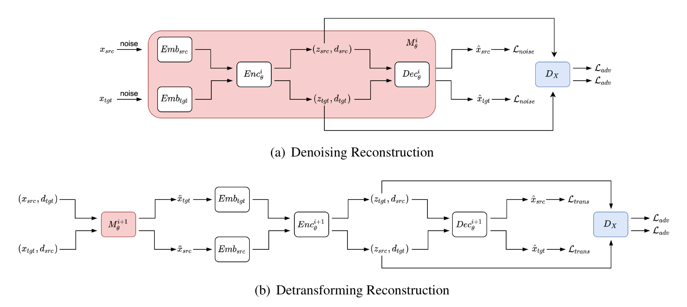

# Data Augmentation for Cross-Domain Named Entity Recognition
<p align="right"><i>Authors: Shuguang Chen, Gustavo Aguilar, Leonardo Neves and Thamar Solorio</i></p> 

[](https://opensource.org/licenses/MIT) 

This repository contains the implementations of the system described in the paper ["Data Augmentation for Cross-Domain Named Entity Recognition"](https://aclanthology.org/2021.emnlp-main.434) at [EMNLP 2021](https://2021.emnlp.org) conference.

<div></div>

The main contribution of this paper is a novel neural architecture that can learn the textual patterns and effectively transform the text from a high-resource to a low-resource domain. Please refer to the [paper]() for details.

## Installation
We have updated the code to work with Python 3.9, Pytorch 1.9, and CUDA 11.1. If you use conda, you can set up the environment as follows:
```bash
conda create -n style_NER python==3.9
conda activate style_NER
conda install pytorch==1.9 cudatoolkit=11.1 -c pytorch
```

Also, install the dependencies specified in the requirements.txt:
```
pip install -r requirements.txt
```

## Data
Please download the data with the following links: [OntoNotes-5.0-NER-BIO](https://github.com/yuchenlin/OntoNotes-5.0-NER-BIO) and [Temporal Twitter Corpus](https://github.com/shrutirij/temporal-twitter-corpus). We provide two toy datasets under the `data/linearized_domain` directory for cross-domain mapping experiments and `data/ner` directory for NER experiments. After downloading the data with the links above, you may need to preprocess it so that it can have the same format as toy datasets and put them under the corresponding directory.

##### Data pre-processing
For data pre-processing, we provide some functions under the `src/commons/preproc_domain.py` and `src/commons/preproc_ner.py` directory. You can use them to convert the data to the json format for cross-domain mapping experiments.

##### Data post-processing
After generating the data, you may want to use the code under the `src/commons/postproc_domain.py` directory to convert the data from json to CoNLL format for named entity recognition experiments.


## Running

There are two main stages to run this project.
1. Cross-domain mapping with cross-domain autoencoder
2. Named entity recognition with sequencel labeling model

#### 1. Cross-domain Mapping

##### Training
You can train a model from pre-defined config files in this repo with the following command:
```
CUDA_VISIBLE_DEVICES=[gpu_id] python src/exp_domain/main.py --config configs/exp_domain/cdar1.0-nw-sm.json
```

The code saves a model checkpoint after every epoch if the model improves (either lower loss or higher metric). You will notice that a directory is created using the experiment id (e.g. style_NER/checkpoints/cdar1.0-nw-sm/). You can resume training by running the same command.

<ins>Two phases training</ins>: our training algorithm includes two phases: 1) in the first phase, we train the model with only denoising reconstruction and domain classification, and 2) in the second phase, we train the model together with denoising reconstruction, detransforming reconstruction, and the domain classification. To do this, you can simply set `lambda_cross` as 0 for the first phase and 1 for the second phase in the config file.

```json
    ...
    "lambda_coef":{
        "lambda_auto": 1.0,
        "lambda_adv": 10.0,
        "lambda_cross": 1.0
    }
    ...
```

##### Evaluate
To evaluate the model, use --mode eval (default: train):
```
CUDA_VISIBLE_DEVICES=[gpu_id] python src/exp_domain/main.py --config configs/exp_domain/cdar1.0-nw-sm.json --mode eval
```

##### Generation
To evaluate the model, use --mode generate (default: train):
```
CUDA_VISIBLE_DEVICES=[gpu_id] python src/exp_domain/main.py --config configs/exp_domain/cdar1.0-nw-sm.json --mode generate
```

#### 2. Named Entity Recognition
We fine-tune a sequence labeling model (BERT + Linear) to evaluate our cross-domain mapping method. After generating the data, you can add the path of the generated data into the configuration file and run the code with the following command:
```
CUDA_VISIBLE_DEVICES=[gpu_id] python src/exp_ner/main.py --config configs/exp_ner/ner1.0-nw-sm.json
```


## Citation
```
@inproceedings{chen-etal-2021-data,
    title = "Data Augmentation for Cross-Domain Named Entity Recognition",
    author = "Chen, Shuguang  and
      Aguilar, Gustavo  and
      Neves, Leonardo  and
      Solorio, Thamar",
    booktitle = "Proceedings of the 2021 Conference on Empirical Methods in Natural Language Processing",
    month = nov,
    year = "2021",
    address = "Online and Punta Cana, Dominican Republic",
    publisher = "Association for Computational Linguistics",
    url = "https://aclanthology.org/2021.emnlp-main.434",
    pages = "5346--5356",
    abstract = "Current work in named entity recognition (NER) shows that data augmentation techniques can produce more robust models. However, most existing techniques focus on augmenting in-domain data in low-resource scenarios where annotated data is quite limited. In this work, we take this research direction to the opposite and study cross-domain data augmentation for the NER task. We investigate the possibility of leveraging data from high-resource domains by projecting it into the low-resource domains. Specifically, we propose a novel neural architecture to transform the data representation from a high-resource to a low-resource domain by learning the patterns (e.g. style, noise, abbreviations, etc.) in the text that differentiate them and a shared feature space where both domains are aligned. We experiment with diverse datasets and show that transforming the data to the low-resource domain representation achieves significant improvements over only using data from high-resource domains.",
}
```

## Contact
Feel free to get in touch via email to schen52@uh.edu.
